# 🚀 CI/CD 自动部署到 GitHub Pages

本文档详细说明如何设置自动化部署流程，将Alex项目网站自动部署到GitHub Pages。

## 📋 目录

- [🔧 设置说明](#设置说明)
- [🔄 工作流程](#工作流程)
- [🛠️ 配置选项](#配置选项)
- [🚨 故障排除](#故障排除)
- [📊 监控和维护](#监控和维护)

## 🔧 设置说明

### 1. 启用GitHub Pages

1. 进入你的仓库设置页面
2. 滚动到 **"Pages"** 部分
3. 在 **"Source"** 下选择 **"GitHub Actions"**
4. 点击 **"Save"**

### 2. 配置仓库权限

确保GitHub Actions有足够的权限：

1. 进入 **Settings > Actions > General**
2. 在 **"Workflow permissions"** 部分选择：
   - ✅ **"Read and write permissions"**
   - ✅ **"Allow GitHub Actions to create and approve pull requests"**

### 3. 文件结构

确保你的仓库包含以下文件：

```
.github/workflows/
├── ci.yml              # 主CI流程（测试、构建）
└── deploy-pages.yml    # GitHub Pages部署流程

docs/
├── index.html          # 网站首页
├── manifest.json       # PWA配置
├── robots.txt          # SEO配置
├── sitemap.xml         # 网站地图
└── deploy.sh           # 本地部署脚本
```

## 🔄 工作流程

### 自动触发条件

部署会在以下情况自动触发：

1. **推送到main分支**，且包含以下路径的更改：
   - `docs/**` - 网站文件更改
   - `README.md` - 项目文档更改
   - `.github/workflows/deploy-pages.yml` - 部署配置更改

2. **手动触发**：
   - 进入 **Actions** 标签页
   - 选择 **"Deploy to GitHub Pages"** 工作流
   - 点击 **"Run workflow"**

### 部署流程

```mermaid
graph LR
    A[代码推送] --> B[构建阶段]
    B --> C[生成统计]
    C --> D[验证HTML]
    D --> E[优化资源]
    E --> F[上传构件]
    F --> G[部署阶段]
    G --> H[发布到Pages]
    H --> I[通知完成]
```



#### 🏗️ 构建阶段 (Build Job)

1. **📥 检出代码** - 获取最新代码
2. **🔧 设置Pages** - 配置GitHub Pages环境
3. **📊 生成项目统计** - 计算代码行数、文件数等
4. **🎨 更新构建信息** - 在网站中注入最新构建时间
5. **🔍 验证HTML** - 检查HTML结构和必要标签
6. **🛠️ 优化资源** - 压缩资源文件
7. **📦 上传构件** - 准备部署包

#### 🚀 部署阶段 (Deploy Job)

1. **🚀 部署到GitHub Pages** - 发布网站
2. **📝 创建部署摘要** - 生成部署报告

#### 📢 通知阶段 (Notify Job)

1. **📢 通知部署状态** - 报告成功或失败状态

## 🛠️ 配置选项

### 环境变量

可以在 `.github/workflows/deploy-pages.yml` 中配置：

```yaml
env:
  # 网站配置
  SITE_URL: "https://cklxx.github.io/Alex-Code"
  SITE_TITLE: "Alex - AI-Powered Coding Assistant"
  
  # 构建配置
  NODE_VERSION: "18"
  OPTIMIZE_ASSETS: "true"
```

### 自定义统计

在 `deploy-pages.yml` 中可以添加更多项目统计：

```bash
# 添加测试覆盖率统计
COVERAGE=$(go test -coverprofile=coverage.out ./... 2>/dev/null && go tool cover -func=coverage.out | grep total | awk '{print $3}' || echo "0%")

# 添加依赖数量
DEPENDENCIES=$(go list -m all | wc -l || echo "0")
```

### 部署路径定制

如果需要自定义部署路径：

```yaml
- name: 📦 Upload artifact
  uses: actions/upload-pages-artifact@v3
  with:
    path: ./docs  # 更改为你的文档目录
```

## 🚨 故障排除

### 常见问题

#### 1. 权限错误
```
Error: Resource not accessible by integration
```

**解决方案**：
- 检查仓库 Settings > Actions > General > Workflow permissions
- 确保选择了 "Read and write permissions"

#### 2. 页面404错误
```
This site can't be reached
```

**解决方案**：
- 检查 Settings > Pages 是否设置为 "GitHub Actions"
- 确保 `docs/index.html` 文件存在
- 等待5-10分钟让DNS生效

#### 3. 构建失败
```
HTML validation failed
```

**解决方案**：
- 检查 `docs/index.html` 是否包含必要的标签：
  ```html
  <title>...</title>
  <meta name="viewport" content="width=device-width, initial-scale=1.0">
  ```

#### 4. 资源加载失败
```
Failed to load CSS/JS files
```

**解决方案**：
- 确保所有资源使用相对路径
- 检查文件权限和路径大小写

### 调试方法

#### 1. 查看构建日志
1. 进入 **Actions** 标签页
2. 点击最近的工作流运行
3. 展开失败的步骤查看详细日志

#### 2. 本地测试
```bash
# 本地运行部署脚本
cd docs/
./deploy.sh

# 选择选项 1 启动本地服务器
# 在浏览器中访问 http://localhost:8000
```

#### 3. 手动触发部署
1. 进入 **Actions** 标签页
2. 选择 **"Deploy to GitHub Pages"**
3. 点击 **"Run workflow"**
4. 观察日志输出

## 📊 监控和维护

### 部署状态监控

你可以通过以下方式监控部署状态：

1. **GitHub Actions徽章**：
   ```markdown
   
   ```

2. **网站状态检查**：
   ```bash
   curl -I https://cklxx.github.io/Alex-Code/
   ```

### 定期维护任务

#### 1. 更新依赖

每月检查并更新GitHub Actions：

```yaml
# 当前版本
- uses: actions/checkout@v4
- uses: actions/configure-pages@v4
- uses: actions/upload-pages-artifact@v3
- uses: actions/deploy-pages@v4
```

#### 2. 性能优化

定期检查网站性能：

- 使用 [PageSpeed Insights](https://pagespeed.web.dev/)
- 检查 [Web Vitals](https://web.dev/vitals/)
- 监控加载时间

#### 3. SEO维护

- 更新 `sitemap.xml` 的 `lastmod` 时间
- 检查 `robots.txt` 配置
- 验证 OpenGraph 和 Twitter 卡片

### 自动化维护脚本

可以添加定期任务来自动维护：

```yaml
name: Weekly Maintenance

on:
  schedule:
    - cron: '0 0 * * 0'  # 每周日运行

jobs:
  maintain:
    runs-on: ubuntu-latest
    steps:
      - name: Update sitemap
        run: |
          # 更新sitemap的lastmod时间
          sed -i "s/<lastmod>.*<\/lastmod>/<lastmod>$(date +%Y-%m-%d)<\/lastmod>/" docs/sitemap.xml
```

## 📈 性能指标

部署完成后，可以通过以下指标评估网站性能：

- **📊 Lighthouse 分数**: 目标 > 90
- **⚡ 首次内容绘制 (FCP)**: 目标 < 1.5s
- **🚀 最大内容绘制 (LCP)**: 目标 < 2.5s
- **📱 移动端友好性**: 100%

## 🔗 相关链接

- [GitHub Pages 文档](https://docs.github.com/en/pages)
- [GitHub Actions 文档](https://docs.github.com/en/actions)
- [Web Performance 最佳实践](https://web.dev/performance/)
- [PWA 开发指南](https://web.dev/progressive-web-apps/)

---

## 💡 小贴士

1. **快速部署**：推送包含 `[deploy]` 的commit消息会优先触发部署
2. **预览分支**：可以为 `develop` 分支创建预览环境
3. **缓存优化**：使用 `Cache-Control` 头部优化静态资源缓存
4. **安全检查**：定期扫描依赖漏洞和安全问题

有问题？查看 [Issues](https://github.com/cklxx/Alex-Code/issues) 或创建新的issue！