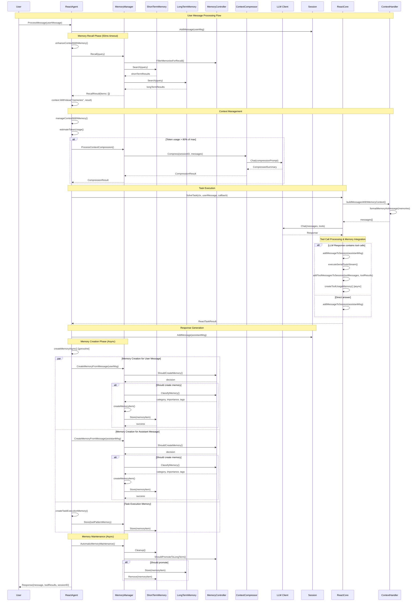
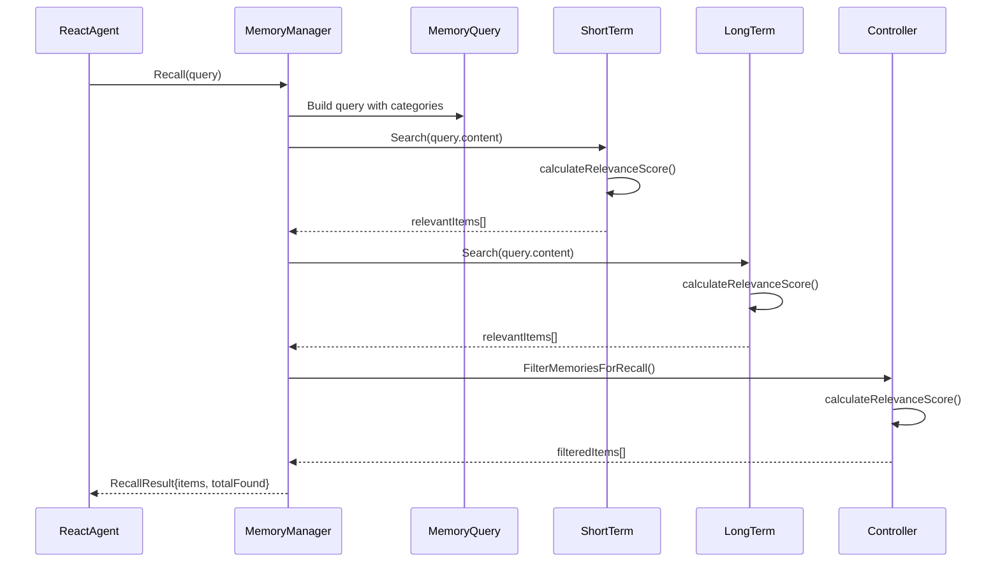
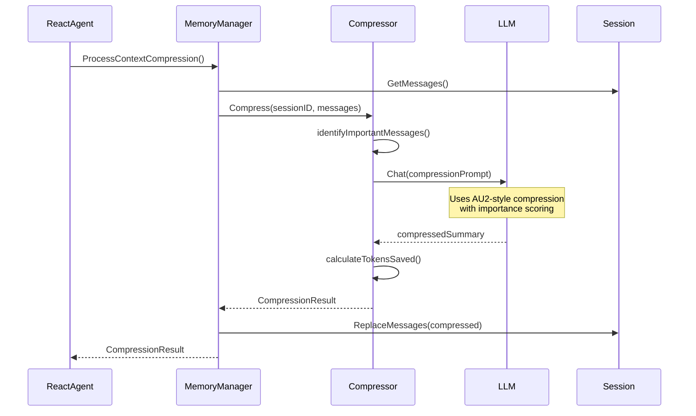
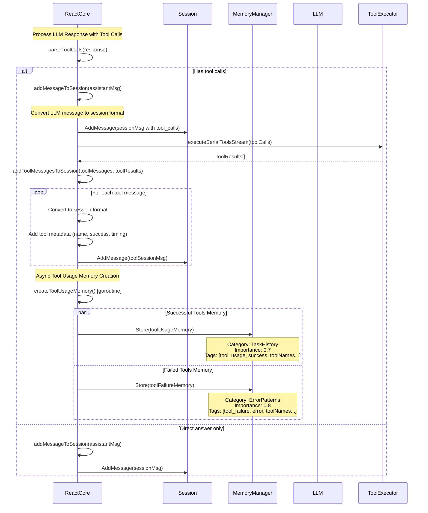
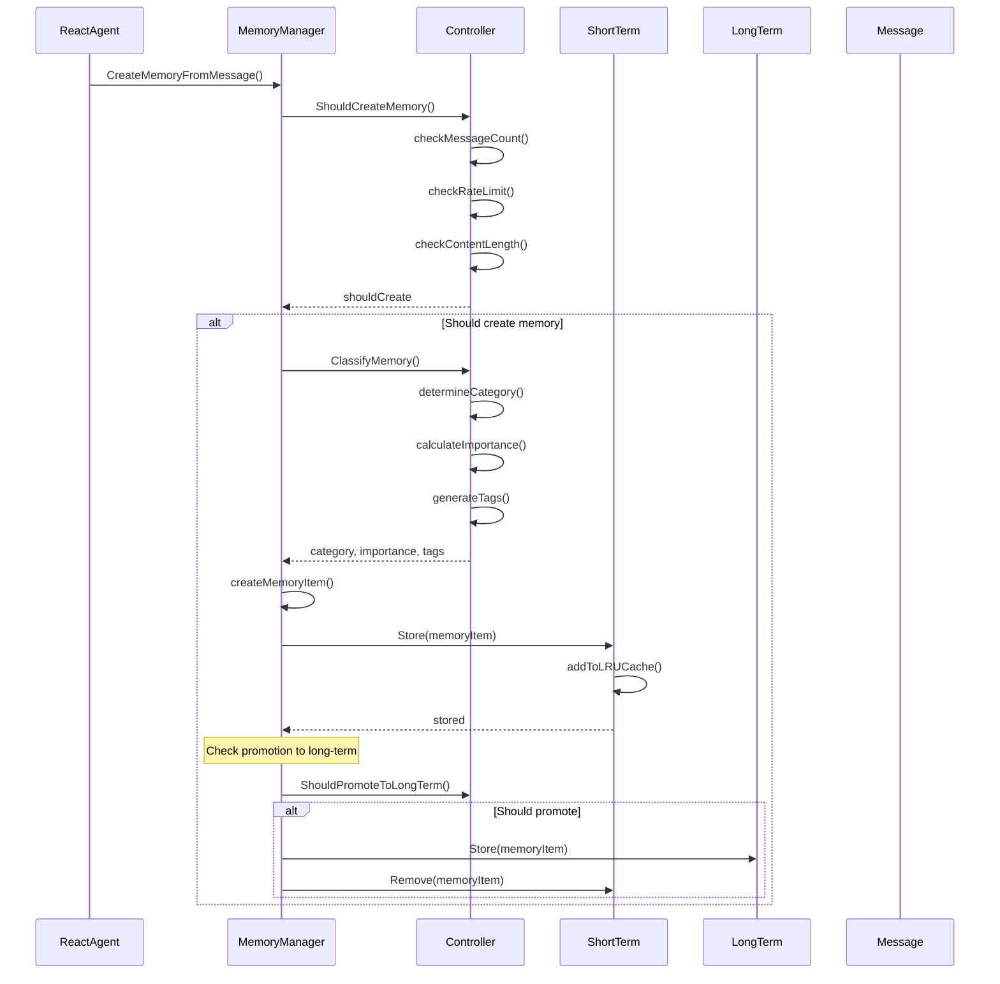
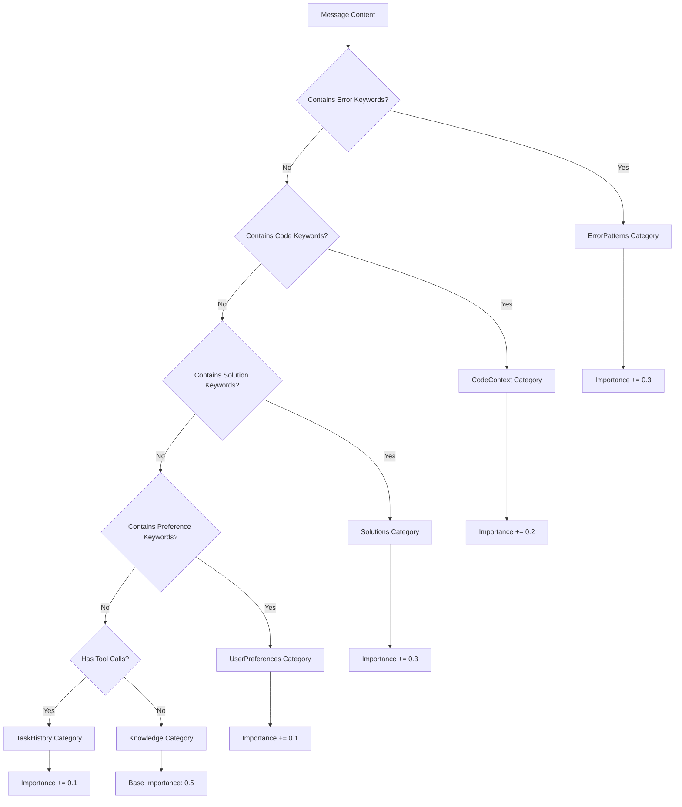
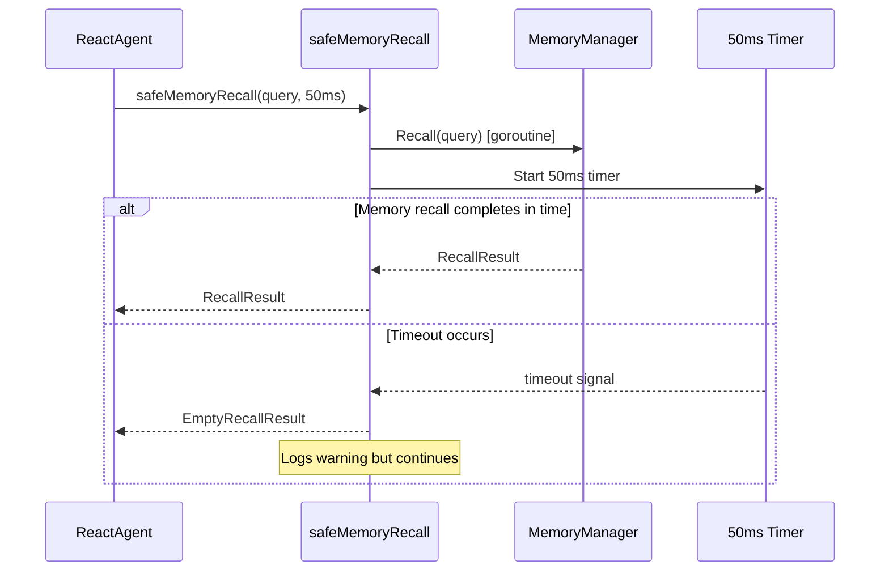
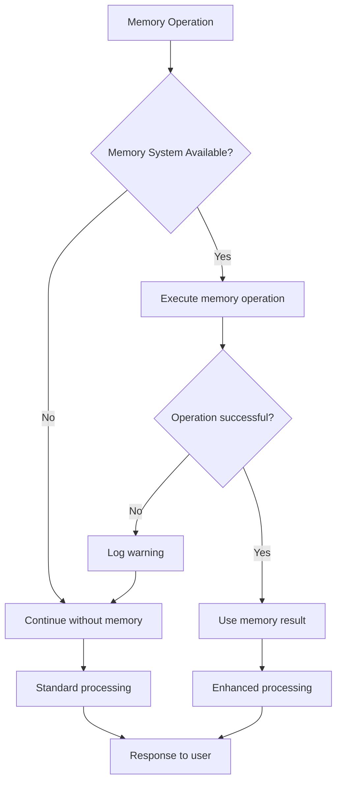

# Memory System Sequence Diagram

## ReactAgent Memory System Call Flow



## Key Components Interaction

### 1. Memory Recall Flow (Synchronous - 50ms timeout)



### 2. Context Compression Flow (When needed)



### 3. Tool Call Message Processing Flow



### 4. Memory Creation Flow (Asynchronous)



## Memory Categories and Processing

### Memory Classification Logic



## Performance Considerations

### Memory Recall Timeout Protection



## Error Handling and Fallbacks



## Enhanced Tool Call Processing

### New Features Added

**Tool Message Session Integration**: All LLM responses and tool execution results are now properly added to the session, enabling the memory system to learn from:

1. **Assistant Messages**: LLM responses with tool call information
2. **Tool Messages**: Tool execution results with metadata (success/failure, execution time, errors)
3. **Tool Usage Patterns**: Automatic memory creation for successful tool chains
4. **Tool Failure Patterns**: High-importance memory creation for failed tools to avoid repeated errors

### Tool Memory Categories

```
Tool Usage Memory (TaskHistory):
- Importance: 0.7
- Tags: [tool_usage, success, <tool_names>]
- Content: "Successfully used tools: file_read, todo_update (total time: 150ms)"

Tool Failure Memory (ErrorPatterns):
- Importance: 0.8 (higher to prevent repeat failures)
- Tags: [tool_failure, error, <tool_names>]
- Content: "Failed tools: invalid_tool"
```

### Session Message Enhancement

Tool-related messages now include rich metadata:
- **Tool Call Tracking**: Conversion of LLM tool calls to session format
- **Execution Metrics**: Duration, success/failure status
- **Error Information**: Detailed error messages for failed tools
- **Tool Identification**: Tool names and arguments for analysis

## Summary

This memory system provides:

1. **Intelligent Context Management**: Automatic memory recall and context compression
2. **Performance Optimization**: Async memory operations with timeout protection
3. **Graceful Degradation**: Continues working even if memory system fails
4. **Smart Classification**: 6-category memory system with importance scoring
5. **Dual Storage**: Short-term LRU cache + long-term persistent storage
6. **Seamless Integration**: Transparent memory enhancement of ReactAgent responses
7. **🆕 Tool Call Learning**: Complete tool usage pattern learning and error prevention
8. **🆕 Rich Tool Metadata**: Comprehensive tool execution tracking and analysis

The system maintains the <30ms response time target by using async memory creation and 50ms timeout for memory recall operations. Tool call processing adds comprehensive learning capabilities without impacting response performance.