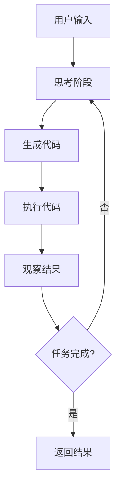

# CodeAct实践过程中常见问题和解决方案 - 深度调研报告

## 目录
1. [CodeAct概述](#codeact概述)
2. [核心技术原理](#核心技术原理)
3. [常见问题分析](#常见问题分析)
4. [解决方案详解](#解决方案详解)
5. [代码实现细节](#代码实现细节)
6. [最佳实践建议](#最佳实践建议)
7. [性能优化策略](#性能优化策略)
8. [未来发展趋势](#未来发展趋势)

## CodeAct概述

### 定义与核心概念

**CodeAct** (Code + Act) 是一个创新的LLM代理架构，它将**可执行代码**作为统一的动作空间，而不是传统的文本或JSON格式。CodeAct代理通过生成、执行和迭代Python代码来解决复杂的多步骤任务。

### 与ReAct的关系

CodeAct建立在ReAct (Reasoning + Acting) 框架之上，但有重要区别：
- **ReAct**: Think → Act → Observe 循环，使用预定义工具
- **CodeAct**: Think → Code → Execute → Observe 循环，使用可执行代码

### 技术优势

1. **统一动作空间**: 用Python代码替代分散的工具调用
2. **动态适应性**: 基于执行结果动态调整后续代码
3. **自我调试能力**: 利用错误信息进行代码修正
4. **扩展性**: 可利用整个Python生态系统

## 核心技术原理

### 架构组件

```python
# CodeAct系统核心组件
class CodeActSystem:
    def __init__(self):
        self.llm_serving = LLMServing()        # LLM服务层 (vLLM/llama.cpp)
        self.code_executor = CodeExecutor()    # 代码执行引擎 (Jupyter-based)
        self.session_manager = SessionManager() # 会话管理
        self.interaction_ui = InteractionUI()   # 交互界面
```

### 执行流程



### 核心算法

```python
def codeact_loop(user_query, max_iterations=10):
    """CodeAct核心执行循环"""
    context = initialize_context(user_query)
    
    for iteration in range(max_iterations):
        # 思考阶段
        reasoning = llm.think(context)
        
        # 代码生成阶段
        code = llm.generate_code(reasoning, context)
        
        # 代码执行阶段
        try:
            result = execute_code(code)
            observation = format_observation(result)
        except Exception as e:
            observation = format_error(e)
        
        # 更新上下文
        context.update(reasoning, code, observation)
        
        # 检查是否完成
        if is_task_complete(observation):
            break
    
    return generate_final_response(context)
```

## 常见问题分析

### 1. 模型幻觉问题

**问题描述**: 
- LLM生成不存在的工具或函数调用
- 假设存在不可用的Python包或API

**具体表现**:
```python
# 错误示例：使用不存在的函数
import nonexistent_package  # 幻觉生成的包
result = magic_function()   # 不存在的函数
```

**根本原因**:
- 缺乏微调或少样本提示
- 模型对可用工具集合认知不准确
- 上下文信息不足

### 2. 解析错误问题

**问题描述**:
- LLM输出格式不符合预期
- 代码语法错误或结构异常

**具体表现**:
```python
# 错误的代码格式
def calculate():
    return 1 + 2  # 缺少必要的上下文信息
    
# 不完整的代码块
import pandas as pd
df = pd.read_csv(  # 未完成的语句
```

**根本原因**:
- 指令遵循能力不足
- 输出格式约束不明确
- 复杂任务下的注意力分散

### 3. 错误传播问题

**问题描述**:
- 早期步骤的错误影响后续执行
- 错误累积导致任务失败

**具体表现**:
```python
# 错误传播示例
step1_result = faulty_calculation()  # 第一步错误
step2_result = process_data(step1_result)  # 错误传播
final_result = generate_report(step2_result)  # 最终错误
```

### 4. 性能和扩展性问题

**问题描述**:
- 大规模任务处理效率低下
- 内存使用过度
- 执行超时

**具体表现**:
```python
# 性能问题示例
def inefficient_processing():
    large_data = load_massive_dataset()  # 内存问题
    for item in large_data:
        expensive_operation(item)  # 时间复杂度问题
```

### 5. 安全性问题

**问题描述**:
- 恶意代码执行风险
- 系统资源滥用
- 数据泄露风险

**具体表现**:
```python
# 安全风险示例
import os
os.system("rm -rf /")  # 危险的系统调用
```

## 解决方案详解

### 1. 幻觉问题解决方案

#### 方案A: 增强型提示工程
```python
def create_enhanced_prompt():
    return """
    你是一个CodeAct代理。请注意：
    1. 只使用以下可用的工具和包：{available_tools}
    2. 如果不确定某个函数是否存在，请先检查
    3. 遇到错误时，请分析错误信息并调整代码
    
    可用工具列表：
    - pandas: 数据处理
    - numpy: 数值计算
    - matplotlib: 数据可视化
    - requests: HTTP请求
    """
```

#### 方案B: 工具验证机制
```python
class ToolValidator:
    def __init__(self, allowed_tools):
        self.allowed_tools = set(allowed_tools)
    
    def validate_code(self, code):
        """验证代码中使用的工具是否在允许列表中"""
        ast_tree = ast.parse(code)
        imports = self.extract_imports(ast_tree)
        
        for import_name in imports:
            if import_name not in self.allowed_tools:
                raise ToolValidationError(f"Tool {import_name} not allowed")
        
        return True
```

### 2. 解析错误解决方案

#### 方案A: 错误重试机制
```python
class ErrorHandlingAgent:
    def __init__(self, max_retries=3):
        self.max_retries = max_retries
    
    def execute_with_retry(self, code):
        """带重试的代码执行"""
        for attempt in range(self.max_retries):
            try:
                result = self.execute_code(code)
                return result
            except SyntaxError as e:
                if attempt < self.max_retries - 1:
                    code = self.fix_syntax_error(code, e)
                else:
                    raise
```

#### 方案B: 渐进式代码生成
```python
def progressive_code_generation(task, context):
    """渐进式代码生成，逐步完善"""
    code_blocks = []
    
    # 第一步：生成基础结构
    basic_structure = llm.generate_basic_structure(task)
    code_blocks.append(basic_structure)
    
    # 第二步：填充实现细节
    for block in code_blocks:
        detailed_code = llm.enhance_code_block(block, context)
        code_blocks.append(detailed_code)
    
    return merge_code_blocks(code_blocks)
```

### 3. 错误传播解决方案

#### 方案A: 状态检查点机制
```python
class CheckpointManager:
    def __init__(self):
        self.checkpoints = []
    
    def create_checkpoint(self, state):
        """创建状态检查点"""
        checkpoint = {
            'timestamp': time.time(),
            'state': deepcopy(state),
            'variables': globals().copy()
        }
        self.checkpoints.append(checkpoint)
        return len(self.checkpoints) - 1
    
    def rollback_to_checkpoint(self, checkpoint_id):
        """回滚到指定检查点"""
        if checkpoint_id < len(self.checkpoints):
            checkpoint = self.checkpoints[checkpoint_id]
            globals().update(checkpoint['variables'])
            return checkpoint['state']
```

#### 方案B: 错误隔离执行
```python
def execute_with_isolation(code_blocks):
    """隔离执行代码块，避免错误传播"""
    results = {}
    
    for i, code_block in enumerate(code_blocks):
        try:
            # 在独立环境中执行
            local_env = create_isolated_environment()
            result = exec(code_block, local_env)
            results[i] = result
        except Exception as e:
            results[i] = ErrorResult(e)
            # 错误不影响后续块的执行
            continue
    
    return results
```

### 4. 性能优化解决方案

#### 方案A: 并发执行优化
```python
import asyncio
import concurrent.futures

class ConcurrentExecutor:
    def __init__(self, max_workers=4):
        self.max_workers = max_workers
    
    async def execute_parallel_tasks(self, tasks):
        """并发执行独立任务"""
        with concurrent.futures.ThreadPoolExecutor(max_workers=self.max_workers) as executor:
            loop = asyncio.get_event_loop()
            futures = [
                loop.run_in_executor(executor, self.execute_task, task)
                for task in tasks
            ]
            results = await asyncio.gather(*futures)
        return results
```

#### 方案B: 内存管理优化
```python
class MemoryOptimizer:
    def __init__(self, memory_limit_mb=1024):
        self.memory_limit = memory_limit_mb * 1024 * 1024
    
    def monitor_memory_usage(self):
        """监控内存使用"""
        import psutil
        process = psutil.Process()
        memory_info = process.memory_info()
        
        if memory_info.rss > self.memory_limit:
            self.trigger_garbage_collection()
            self.clear_large_variables()
    
    def clear_large_variables(self):
        """清理大型变量"""
        import gc
        # 清理未使用的大型对象
        for obj in gc.get_objects():
            if hasattr(obj, '__sizeof__') and obj.__sizeof__() > 100 * 1024 * 1024:
                del obj
        gc.collect()
```

### 5. 安全性解决方案

#### 方案A: 沙箱执行环境
```python
import docker
import tempfile

class SecureExecutor:
    def __init__(self):
        self.docker_client = docker.from_env()
    
    def execute_in_sandbox(self, code):
        """在Docker沙箱中执行代码"""
        with tempfile.NamedTemporaryFile(mode='w', suffix='.py', delete=False) as f:
            f.write(code)
            temp_file = f.name
        
        try:
            container = self.docker_client.containers.run(
                "python:3.9-slim",
                f"python {temp_file}",
                volumes={temp_file: {'bind': temp_file, 'mode': 'ro'}},
                mem_limit="256m",
                cpu_count=1,
                network_mode="none",  # 禁用网络访问
                remove=True
            )
            return container.decode('utf-8')
        finally:
            os.unlink(temp_file)
```

#### 方案B: 代码安全扫描
```python
import ast

class SecurityScanner:
    def __init__(self):
        self.dangerous_functions = {
            'exec', 'eval', 'compile', '__import__',
            'open', 'file', 'input', 'raw_input'
        }
        self.dangerous_modules = {
            'os', 'subprocess', 'sys', 'shutil', 'socket'
        }
    
    def scan_code(self, code):
        """扫描代码中的安全风险"""
        try:
            tree = ast.parse(code)
        except SyntaxError:
            return {'status': 'error', 'message': 'Syntax error in code'}
        
        risks = []
        
        for node in ast.walk(tree):
            if isinstance(node, ast.Call):
                if hasattr(node.func, 'id') and node.func.id in self.dangerous_functions:
                    risks.append(f"Dangerous function call: {node.func.id}")
            
            elif isinstance(node, ast.Import):
                for alias in node.names:
                    if alias.name in self.dangerous_modules:
                        risks.append(f"Dangerous module import: {alias.name}")
        
        return {'status': 'scanned', 'risks': risks}
```

## 代码实现细节

### 完整的CodeAct代理实现

```python
import ast
import asyncio
import logging
from typing import Dict, List, Any, Optional
from dataclasses import dataclass
from enum import Enum

class TaskStatus(Enum):
    PENDING = "pending"
    IN_PROGRESS = "in_progress"
    COMPLETED = "completed"
    FAILED = "failed"

@dataclass
class ExecutionResult:
    success: bool
    output: Any
    error: Optional[str]
    execution_time: float
    memory_usage: int

class CodeActAgent:
    def __init__(self, 
                 llm_client,
                 max_iterations: int = 10,
                 timeout_seconds: int = 120,
                 enable_security_scan: bool = True):
        self.llm_client = llm_client
        self.max_iterations = max_iterations
        self.timeout = timeout_seconds
        self.enable_security_scan = enable_security_scan
        
        # 初始化组件
        self.security_scanner = SecurityScanner()
        self.memory_optimizer = MemoryOptimizer()
        self.checkpoint_manager = CheckpointManager()
        self.execution_history = []
        
        # 配置日志
        logging.basicConfig(level=logging.INFO)
        self.logger = logging.getLogger(__name__)
    
    async def solve_task(self, user_query: str) -> Dict[str, Any]:
        """解决用户任务的主要方法"""
        self.logger.info(f"开始处理任务: {user_query}")
        
        context = self._initialize_context(user_query)
        task_status = TaskStatus.IN_PROGRESS
        
        try:
            for iteration in range(self.max_iterations):
                self.logger.info(f"执行第 {iteration + 1} 次迭代")
                
                # 创建检查点
                checkpoint_id = self.checkpoint_manager.create_checkpoint(context)
                
                # 思考阶段
                reasoning = await self._think_phase(context)
                context['reasoning'] = reasoning
                
                # 代码生成阶段
                code = await self._code_generation_phase(reasoning, context)
                
                # 安全扫描
                if self.enable_security_scan:
                    security_result = self.security_scanner.scan_code(code)
                    if security_result['risks']:
                        self.logger.warning(f"安全风险检测: {security_result['risks']}")
                        continue
                
                # 代码执行阶段
                execution_result = await self._execution_phase(code)
                
                # 记录执行历史
                self.execution_history.append({
                    'iteration': iteration,
                    'code': code,
                    'result': execution_result,
                    'timestamp': time.time()
                })
                
                # 观察阶段
                observation = self._observation_phase(execution_result)
                context['observations'].append(observation)
                
                # 检查任务完成状态
                if self._is_task_complete(observation, context):
                    task_status = TaskStatus.COMPLETED
                    break
                
                # 内存监控
                self.memory_optimizer.monitor_memory_usage()
                
        except Exception as e:
            self.logger.error(f"任务执行失败: {str(e)}")
            task_status = TaskStatus.FAILED
            return self._generate_error_response(e, context)
        
        return self._generate_final_response(context, task_status)
    
    async def _think_phase(self, context: Dict) -> str:
        """思考阶段：分析问题和规划解决方案"""
        thinking_prompt = f"""
        任务: {context['user_query']}
        
        当前上下文:
        - 已执行的观察: {context.get('observations', [])}
        - 可用工具: {context.get('available_tools', [])}
        
        请分析这个任务并制定解决方案。考虑：
        1. 需要什么数据？
        2. 需要执行什么操作？
        3. 预期的输出格式是什么？
        
        请提供详细的思考过程。
        """
        
        response = await self.llm_client.generate(thinking_prompt)
        return response.strip()
    
    async def _code_generation_phase(self, reasoning: str, context: Dict) -> str:
        """代码生成阶段：基于思考结果生成可执行代码"""
        code_prompt = f"""
        基于以下思考过程，生成Python代码来解决任务：
        
        思考过程: {reasoning}
        任务: {context['user_query']}
        
        要求：
        1. 代码必须是完整的、可执行的Python代码
        2. 包含必要的导入语句
        3. 添加适当的错误处理
        4. 使用print()输出中间结果以便调试
        5. 只使用标准库和以下允许的包: {context.get('allowed_packages', [])}
        
        请生成代码：
        ```python
        # 你的代码
        ```
        """
        
        response = await self.llm_client.generate(code_prompt)
        
        # 提取代码块
        code = self._extract_code_block(response)
        return code
    
    async def _execution_phase(self, code: str) -> ExecutionResult:
        """代码执行阶段：在安全环境中执行生成的代码"""
        start_time = time.time()
        
        try:
            # 创建执行环境
            exec_globals = {
                '__builtins__': __builtins__,
                'print': print,
                # 添加安全的内置函数
            }
            exec_locals = {}
            
            # 捕获输出
            from io import StringIO
            import sys
            
            old_stdout = sys.stdout
            captured_output = StringIO()
            sys.stdout = captured_output
            
            try:
                exec(code, exec_globals, exec_locals)
                output = captured_output.getvalue()
            finally:
                sys.stdout = old_stdout
            
            execution_time = time.time() - start_time
            
            return ExecutionResult(
                success=True,
                output=output,
                error=None,
                execution_time=execution_time,
                memory_usage=self._get_memory_usage()
            )
            
        except Exception as e:
            execution_time = time.time() - start_time
            return ExecutionResult(
                success=False,
                output=None,
                error=str(e),
                execution_time=execution_time,
                memory_usage=self._get_memory_usage()
            )
    
    def _observation_phase(self, execution_result: ExecutionResult) -> Dict:
        """观察阶段：分析执行结果并提取有用信息"""
        observation = {
            'success': execution_result.success,
            'execution_time': execution_result.execution_time,
            'memory_usage': execution_result.memory_usage
        }
        
        if execution_result.success:
            observation['output'] = execution_result.output
            observation['message'] = "代码执行成功"
        else:
            observation['error'] = execution_result.error
            observation['message'] = f"代码执行失败: {execution_result.error}"
        
        return observation
    
    def _is_task_complete(self, observation: Dict, context: Dict) -> bool:
        """判断任务是否完成"""
        if not observation['success']:
            return False
        
        # 简单的启发式规则
        output = observation.get('output', '')
        
        # 检查是否有明确的结果输出
        if output and len(output.strip()) > 0:
            return True
        
        return False
    
    def _initialize_context(self, user_query: str) -> Dict:
        """初始化执行上下文"""
        return {
            'user_query': user_query,
            'observations': [],
            'available_tools': self._get_available_tools(),
            'allowed_packages': ['numpy', 'pandas', 'matplotlib', 'requests', 'json', 'datetime'],
            'start_time': time.time()
        }
    
    def _get_available_tools(self) -> List[str]:
        """获取可用工具列表"""
        return [
            'numpy - 数值计算',
            'pandas - 数据处理',
            'matplotlib - 数据可视化',
            'requests - HTTP请求',
            'json - JSON处理',
            'datetime - 日期时间处理'
        ]
    
    def _extract_code_block(self, response: str) -> str:
        """从LLM响应中提取代码块"""
        import re
        
        # 查找```python代码块
        pattern = r'```python\n(.*?)\n```'
        match = re.search(pattern, response, re.DOTALL)
        
        if match:
            return match.group(1).strip()
        
        # 如果没有找到代码块标记，尝试提取整个响应
        return response.strip()
    
    def _get_memory_usage(self) -> int:
        """获取当前内存使用量"""
        import psutil
        process = psutil.Process()
        return process.memory_info().rss
    
    def _generate_final_response(self, context: Dict, status: TaskStatus) -> Dict[str, Any]:
        """生成最终响应"""
        total_time = time.time() - context['start_time']
        
        return {
            'status': status.value,
            'user_query': context['user_query'],
            'total_execution_time': total_time,
            'iterations_count': len(self.execution_history),
            'observations': context['observations'],
            'execution_history': self.execution_history,
            'final_output': context['observations'][-1] if context['observations'] else None
        }
    
    def _generate_error_response(self, error: Exception, context: Dict) -> Dict[str, Any]:
        """生成错误响应"""
        return {
            'status': TaskStatus.FAILED.value,
            'error': str(error),
            'error_type': type(error).__name__,
            'context': context,
            'execution_history': self.execution_history
        }

# 使用示例
async def main():
    # 初始化LLM客户端（这里需要根据实际使用的LLM API进行配置）
    # llm_client = YourLLMClient(api_key="your_api_key")
    
    # 创建CodeAct代理
    agent = CodeActAgent(
        llm_client=llm_client,
        max_iterations=10,
        timeout_seconds=120,
        enable_security_scan=True
    )
    
    # 执行任务
    result = await agent.solve_task("计算斐波那契数列的前10项并绘制图表")
    
    print("任务执行结果:")
    print(f"状态: {result['status']}")
    print(f"执行时间: {result['total_execution_time']:.2f}秒")
    print(f"迭代次数: {result['iterations_count']}")
    
    if result['final_output']:
        print(f"最终输出: {result['final_output']['output']}")

if __name__ == "__main__":
    asyncio.run(main())
```

### 高级调试工具

```python
class CodeActDebugger:
    def __init__(self, agent: CodeActAgent):
        self.agent = agent
        self.debug_logs = []
    
    def add_breakpoint(self, condition: str):
        """添加条件断点"""
        def breakpoint_decorator(func):
            def wrapper(*args, **kwargs):
                if eval(condition):
                    self._enter_debug_mode(func.__name__, args, kwargs)
                return func(*args, **kwargs)
            return wrapper
        return breakpoint_decorator
    
    def _enter_debug_mode(self, func_name: str, args, kwargs):
        """进入调试模式"""
        print(f"断点触发: {func_name}")
        print(f"参数: args={args}, kwargs={kwargs}")
        print(f"当前状态: {self.agent.execution_history[-1] if self.agent.execution_history else 'None'}")
        
        while True:
            command = input("调试命令 (c: 继续, s: 查看状态, h: 帮助): ")
            if command == 'c':
                break
            elif command == 's':
                self._show_current_state()
            elif command == 'h':
                self._show_help()
    
    def visualize_execution_flow(self):
        """可视化执行流程"""
        import matplotlib.pyplot as plt
        import networkx as nx
        
        G = nx.DiGraph()
        
        for i, entry in enumerate(self.agent.execution_history):
            G.add_node(i, label=f"Iteration {i+1}")
            if i > 0:
                G.add_edge(i-1, i)
        
        pos = nx.spring_layout(G)
        nx.draw(G, pos, with_labels=True, node_color='lightblue', 
                node_size=1000, font_size=10, arrows=True)
        plt.title("CodeAct Execution Flow")
        plt.show()
```

## 最佳实践建议

### 1. 提示工程最佳实践

```python
class PromptEngineering:
    @staticmethod
    def create_system_prompt():
        return """
        你是一个专业的CodeAct代理。遵循以下原则：
        
        1. **安全第一**: 永远不要执行危险的系统命令
        2. **渐进式开发**: 将复杂任务分解为简单步骤
        3. **错误处理**: 总是包含try-catch块
        4. **调试友好**: 使用print语句输出中间结果
        5. **资源意识**: 注意内存和CPU使用
        
        代码格式要求：
        - 使用清晰的变量名
        - 添加必要的注释
        - 遵循PEP8代码规范
        """
    
    @staticmethod
    def create_task_prompt(task: str, context: Dict):
        return f"""
        任务: {task}
        
        上下文信息:
        - 可用工具: {context.get('tools', [])}
        - 数据来源: {context.get('data_sources', [])}
        - 输出要求: {context.get('output_format', '文本')}
        
        请生成完整的Python代码来解决这个任务。
        """
```

### 2. 错误处理策略

```python
class ErrorHandlingStrategy:
    @staticmethod
    def comprehensive_error_handling():
        return """
        def safe_execute(func, *args, **kwargs):
            try:
                return func(*args, **kwargs)
            except ImportError as e:
                print(f"模块导入错误: {e}")
                return None
            except ValueError as e:
                print(f"数值错误: {e}")
                return None
            except FileNotFoundError as e:
                print(f"文件未找到: {e}")
                return None
            except Exception as e:
                print(f"未知错误: {type(e).__name__}: {e}")
                return None
        """
```

### 3. 性能监控

```python
class PerformanceMonitor:
    def __init__(self):
        self.metrics = {}
    
    def track_execution_time(self, func):
        """执行时间跟踪装饰器"""
        def wrapper(*args, **kwargs):
            start_time = time.time()
            result = func(*args, **kwargs)
            execution_time = time.time() - start_time
            
            func_name = func.__name__
            if func_name not in self.metrics:
                self.metrics[func_name] = []
            self.metrics[func_name].append(execution_time)
            
            return result
        return wrapper
    
    def get_performance_report(self):
        """生成性能报告"""
        report = {}
        for func_name, times in self.metrics.items():
            report[func_name] = {
                'average_time': sum(times) / len(times),
                'max_time': max(times),
                'min_time': min(times),
                'total_calls': len(times)
            }
        return report
```

## 性能优化策略

### 1. 内存优化

```python
class MemoryOptimization:
    @staticmethod
    def optimize_large_data_processing():
        """大数据处理优化"""
        return """
        # 使用生成器而不是列表
        def process_large_dataset():
            for chunk in pd.read_csv('large_file.csv', chunksize=10000):
                yield process_chunk(chunk)
        
        # 及时释放内存
        def memory_efficient_operation():
            data = load_data()
            result = process_data(data)
            del data  # 显式删除大对象
            gc.collect()  # 强制垃圾回收
            return result
        """
    
    @staticmethod
    def implement_caching():
        """实现智能缓存"""
        return """
        from functools import lru_cache
        
        @lru_cache(maxsize=128)
        def expensive_calculation(param):
            # 昂贵的计算操作
            return complex_operation(param)
        """
```

### 2. 并发优化

```python
class ConcurrencyOptimization:
    @staticmethod
    def async_task_processing():
        """异步任务处理"""
        return """
        import asyncio
        import aiohttp
        
        async def fetch_data(session, url):
            async with session.get(url) as response:
                return await response.json()
        
        async def process_multiple_urls(urls):
            async with aiohttp.ClientSession() as session:
                tasks = [fetch_data(session, url) for url in urls]
                results = await asyncio.gather(*tasks)
                return results
        """
```

## 未来发展趋势

### 1. 增强学习集成

CodeAct未来可能集成强化学习，通过环境反馈不断优化代码生成策略：

```python
class RLEnhancedCodeAct:
    def __init__(self):
        self.policy_network = PolicyNetwork()
        self.value_network = ValueNetwork()
        self.experience_buffer = ExperienceBuffer()
    
    def update_policy(self, reward, state, action):
        """基于奖励更新策略"""
        self.experience_buffer.add(state, action, reward)
        if len(self.experience_buffer) > 1000:
            self.train_networks()
```

### 2. 多模态代码生成

支持图像、音频等多模态输入的代码生成：

```python
class MultimodalCodeAct:
    def process_image_input(self, image_path: str, task_description: str):
        """处理图像输入并生成相应代码"""
        image_features = self.image_encoder.encode(image_path)
        text_features = self.text_encoder.encode(task_description)
        
        combined_features = self.fusion_module(image_features, text_features)
        code = self.code_generator.generate(combined_features)
        
        return code
```

### 3. 自适应代码优化

基于执行反馈自动优化生成的代码：

```python
class AdaptiveOptimizer:
    def optimize_code(self, original_code: str, performance_metrics: Dict):
        """基于性能指标优化代码"""
        if performance_metrics['execution_time'] > 10.0:
            # 优化执行时间
            optimized_code = self.optimize_for_speed(original_code)
        elif performance_metrics['memory_usage'] > 1000000000:  # 1GB
            # 优化内存使用
            optimized_code = self.optimize_for_memory(original_code)
        else:
            optimized_code = original_code
        
        return optimized_code
```

## 结论

CodeAct作为新一代AI代理架构，在代码生成和任务执行方面展现出巨大潜力。通过系统性地解决常见问题，实施最佳实践，并不断优化性能，CodeAct可以成为强大的自动化编程助手。

### 关键收获

1. **统一动作空间**: CodeAct通过可执行代码统一了AI代理的动作空间
2. **自我调试能力**: 通过执行反馈实现代码的自动修正
3. **安全性至关重要**: 必须实施多层安全防护措施
4. **性能优化**: 需要关注内存使用、执行时间和并发处理
5. **错误处理**: 建立完善的错误处理和恢复机制

### 未来展望

CodeAct技术将继续发展，可能在以下方面取得突破：
- 更强的代码生成能力
- 更好的错误诊断和修复
- 支持更多编程语言
- 集成更多外部工具和API
- 提供更直观的可视化调试界面

通过持续的研究和实践，CodeAct有望成为软件开发领域的重要工具。